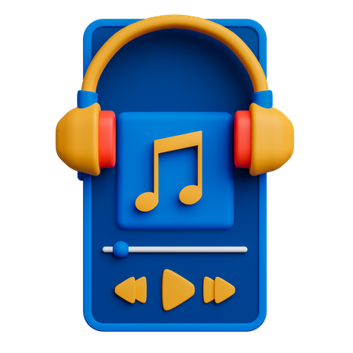
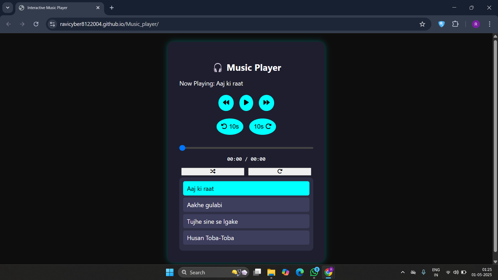

# Interactive Music Player
<p align="center">
  
</p>

An interactive, web-based music player built using **HTML**, **CSS**, and **JavaScript**. This music player offers a modern, dynamic interface with essential features for an engaging and smooth user experience.

## Features:
- **Play/Pause**: Control music playback with a simple button toggle.
- **Next/Previous**: Navigate between songs effortlessly.
- **Shuffle**: Randomize the song order for a more dynamic listening experience.
- **Repeat**: Play the current song or playlist continuously.
- **Dynamic Song List**: Click on a song name to play it instantly.
- **Seekbar**: Track the progress of the song and jump to any part of the track.
- **Responsive Design**: Enjoy the music player on any device with an adaptable UI.

## Technologies Used:
- **HTML**: Structure and content of the music player.
- **CSS**: Styling the user interface with a modern, sleek design.
- **JavaScript**: Functionality for controlling music playback, song navigation, and real-time updates.

## Demo:
Check out the live demo of the music player:
[Interactive Music Player Demo](https://ravicyber8122004.github.io/Music_player/)




## Repository:
Access the code repository for further development and customization:
[Repository Link](https://github.com/ravicyber8122004/Music_player)

## How to Use:
1. **Clone the Repository**:
   ```bash
   git clone https://github.com/ravicyber8122004/Music_player.git
   ```
2. **Open the `index.html` file** in your browser to start the music player.

## Installation:
No installation is required for the demo. Simply open the `index.html` file in your browser.

## Contributions:
Feel free to fork this project, submit issues, or create pull requests to contribute to its improvement.

## Acknowledgments:
Special thanks to **Abhishek Sharma** for his continuous support and motivation throughout the development of this project. Your encouragement and insights have made this possible!

## License:
This project is licensed under the MIT License - see the [LICENSE](LICENSE) file for details.

---

